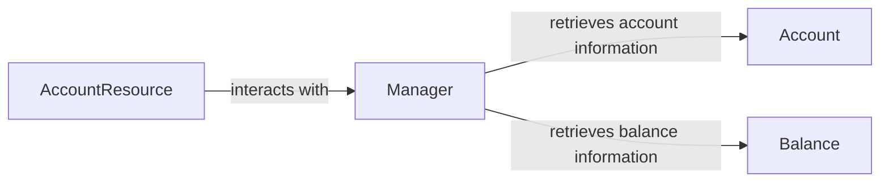

## Component Details

The DigitalOcean Account and Balance subsystem provides functionality to retrieve account information and balance details from the DigitalOcean API. The core components include the Account, Balance, and Manager classes. The Manager class acts as an intermediary, interacting with the DigitalOcean API to fetch account and balance data. The Account and Balance classes encapsulate the data and provide methods to load data from the API response.

### Account
The Account component represents a DigitalOcean account. It provides methods for retrieving account information and loading account data from the DigitalOcean API. It encapsulates account attributes such as email, UUID, and droplet limit.
- **Related Classes/Methods**: `digitalocean.Account.Account` (5:35), `digitalocean.Account.Account:__init__` (6:15), `digitalocean.Account.Account:get_object` (18:24), `digitalocean.Account.Account:load` (26:32)

### Balance
The Balance component represents the balance of a DigitalOcean account. It provides methods for retrieving balance information and loading balance data from the DigitalOcean API. It encapsulates balance attributes such as account balance, month to date usage, and billing rate.
- **Related Classes/Methods**: `digitalocean.Balance.Balance` (5:31), `digitalocean.Balance.Balance:__init__` (6:12), `digitalocean.Balance.Balance:get_object` (15:21), `digitalocean.Balance.Balance:load` (23:28)

### Manager
The Manager component is responsible for managing interactions with the DigitalOcean API. It provides methods for retrieving account and balance information. It acts as a central point for accessing account and balance data.
- **Related Classes/Methods**: `digitalocean.Manager.Manager:get_account` (34:38), `digitalocean.Manager.Manager:get_balance` (40:44)

### AccountResource
The AccountResource component represents a DigitalOcean Account and Balance. It provides methods for retrieving account and balance information. It interacts with the ResourceManager to perform these actions.
- **Related Classes/Methods**: `digitalocean.Account.Account` (5:35), `digitalocean.Balance.Balance` (5:31)