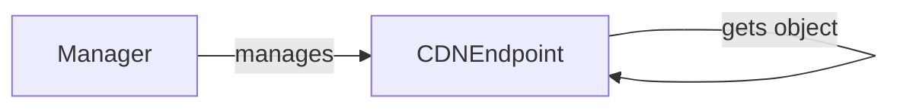

## Component Details

The DigitalOcean CDN management subsystem allows users to create, retrieve, update, and delete CDN endpoints. The Manager component serves as the entry point for accessing CDN endpoint resources, while the CDNEndpoint component represents a single CDN endpoint and provides methods for interacting with the DigitalOcean API to manage the endpoint's lifecycle.

### CDNEndpoint
Represents a CDN Endpoint in DigitalOcean. It allows for creating, retrieving, updating, and deleting CDN endpoints. It interacts with the DigitalOcean API to manage CDN endpoint resources.
- **Related Classes/Methods**: `digitalocean.CDNEndpoint.CDNEndpoint` (5:102), `digitalocean.CDNEndpoint.CDNEndpoint:__init__` (23:32), `digitalocean.CDNEndpoint.CDNEndpoint:get_object` (35:44), `digitalocean.CDNEndpoint.CDNEndpoint:load` (46:56), `digitalocean.CDNEndpoint.CDNEndpoint:create` (58:76), `digitalocean.CDNEndpoint.CDNEndpoint:delete` (79:83), `digitalocean.CDNEndpoint.CDNEndpoint:save` (85:98)

### Manager
The Manager class provides methods for retrieving CDN endpoints. It serves as an entry point for accessing CDN endpoint resources and interacts with the DigitalOcean API.
- **Related Classes/Methods**: `digitalocean.Manager.Manager` (30:481), `digitalocean.Manager.Manager:get_cdn_endpoint` (471:478), `digitalocean.Manager.Manager:get_all_cdn_endpoints` (459:469)