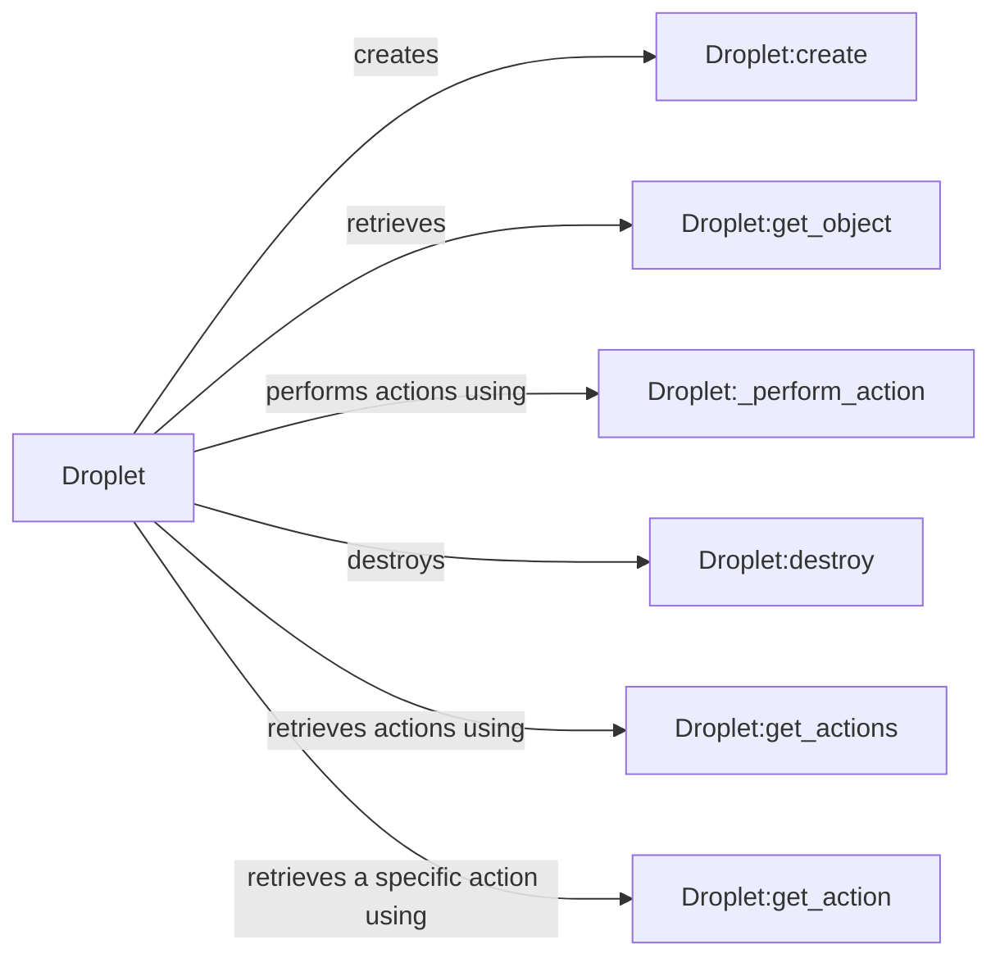

## Component Details

The ComputeResource component, represented by the DigitalOcean Droplet, manages virtual servers (Droplets) through the DigitalOcean API. It encompasses functionalities for creating, retrieving, and destroying Droplets, as well as performing actions like power on/off, reboot, resizing, snapshotting, and managing backups. The component interacts with the DigitalOcean API to provision and manage these resources.

### Droplet
Represents a DigitalOcean Droplet. It provides methods for creating, retrieving, and managing Droplets, including actions like power on/off, reboot, resize, snapshot, and more. It interacts with the DigitalOcean API to perform these operations.
- **Related Classes/Methods**: `digitalocean.Droplet.Droplet` (25:661)

### Droplet:create
Creates a new Droplet. It takes parameters such as name, region, size, image, SSH keys, backups, IPv6, private networking, and user data. It sends a POST request to the DigitalOcean API to create the Droplet.
- **Related Classes/Methods**: `digitalocean.Droplet.Droplet:create` (532:574)

### Droplet:get_object
Retrieves a specific Droplet by its ID. It sends a GET request to the DigitalOcean API to retrieve the Droplet's information.
- **Related Classes/Methods**: `digitalocean.Droplet.Droplet:get_object` (104:113)

### Droplet:_perform_action
A helper method that performs an action on a Droplet, such as power on/off, reboot, etc. It sends a POST request to the DigitalOcean API to initiate the action.
- **Related Classes/Methods**: `digitalocean.Droplet.Droplet:_perform_action` (207:233)

### Droplet:destroy
Destroys a Droplet. It sends a DELETE request to the DigitalOcean API to remove the Droplet.
- **Related Classes/Methods**: `digitalocean.Droplet.Droplet:destroy` (412:418)

### Droplet:get_actions
Retrieves all actions performed on a Droplet. It sends a GET request to the DigitalOcean API to retrieve the actions.
- **Related Classes/Methods**: `digitalocean.Droplet.Droplet:get_actions` (583:597)

### Droplet:get_action
Retrieves a specific action performed on a Droplet by its ID. It sends a GET request to the DigitalOcean API to retrieve the action.
- **Related Classes/Methods**: `digitalocean.Droplet.Droplet:get_action` (599:608)