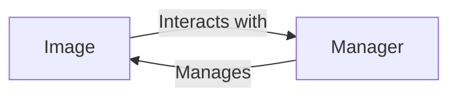

## Component Details

The DigitalOcean Image management subsystem allows users to manage their images (snapshots and distributions) on the DigitalOcean platform. It provides functionalities to list, retrieve, create, destroy, transfer, and rename images. The core components are the Image class, which represents a single image, and the Manager class, which handles collections of images and interacts with the DigitalOcean API.

### Image
Represents a DigitalOcean Image. It allows for creating, loading, destroying, transferring, and renaming images. It interacts with the Manager to perform these actions.
- **Related Classes/Methods**: `digitalocean.Image.Image` (5:162), `digitalocean.Image.Image:__init__` (44:61), `digitalocean.Image.Image:get_object` (64:78), `digitalocean.Image.Image:create` (93:111), `digitalocean.Image.Image:load` (113:133), `digitalocean.Image.Image:destroy` (135:139), `digitalocean.Image.Image:transfer` (141:149), `digitalocean.Image.Image:rename` (151:159)

### Manager
The Manager class is responsible for managing DigitalOcean Images. It provides methods for retrieving different types of images (all, my, global, distro, app) and a specific image by its ID.
- **Related Classes/Methods**: `digitalocean.Manager.Manager` (30:481), `digitalocean.Manager.Manager:get_images` (118:133), `digitalocean.Manager.Manager:get_all_images` (135:141), `digitalocean.Manager.Manager:get_image` (143:150), `digitalocean.Manager.Manager:get_my_images` (152:158), `digitalocean.Manager.Manager:get_global_images` (160:172), `digitalocean.Manager.Manager:get_distro_images` (174:180), `digitalocean.Manager.Manager:get_app_images` (182:188)