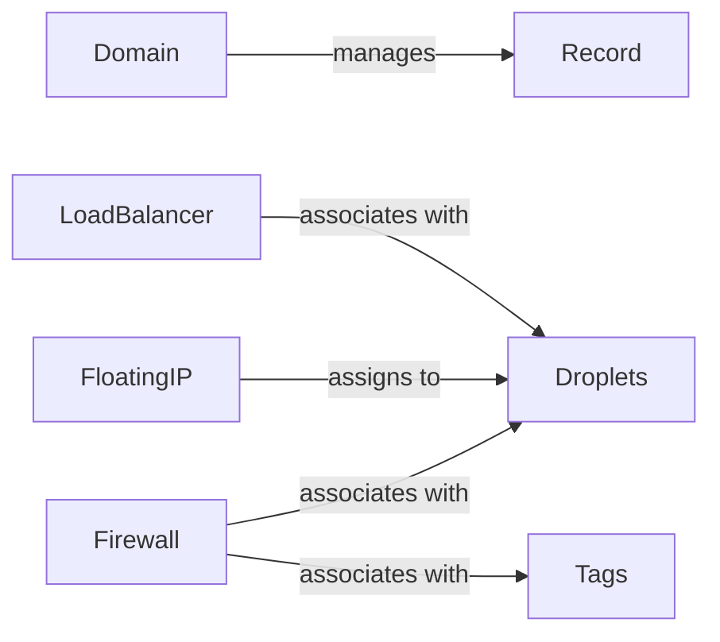

## Component Details

The DigitalOcean Networking Resource Management system provides an interface for managing various networking resources on the DigitalOcean platform. It encompasses components for handling Domains, DNS Records, Floating IPs, Load Balancers, and Firewalls. These components allow users to create, retrieve, update, and delete these resources, enabling them to configure and manage their network infrastructure on DigitalOcean.

### Domain
The Domain component manages domain names and their associated DNS records on DigitalOcean. It provides functionalities to create, retrieve, update, and delete domains and their records. It interacts with the DigitalOcean API to perform these operations.
- **Related Classes/Methods**: `digitalocean.Domain.Domain` (6:172), `digitalocean.Domain.Domain:__init__` (7:13), `digitalocean.Domain.Domain:get_object` (16:22), `digitalocean.Domain.Domain:load` (24:30), `digitalocean.Domain.Domain:destroy` (32:37), `digitalocean.Domain.Domain:create_new_domain_record` (39:90), `digitalocean.Domain.Domain:update_domain_record` (92:126), `digitalocean.Domain.Domain:delete_domain_record` (128:137), `digitalocean.Domain.Domain:create` (139:150), `digitalocean.Domain.Domain:get_records` (152:169)

### Record
The Record component represents a DNS record within a domain. It allows for creating, retrieving, updating, and deleting individual DNS records. It interacts with the Domain component to manage records within a specific domain.
- **Related Classes/Methods**: `digitalocean.Record.Record` (5:126), `digitalocean.Record.Record:__init__` (23:36), `digitalocean.Record.Record:get_object` (39:45), `digitalocean.Record.Record:create` (47:83), `digitalocean.Record.Record:destroy` (85:92), `digitalocean.Record.Record:save` (94:113), `digitalocean.Record.Record:load` (115:123)

### FloatingIP
The FloatingIP component manages floating IP addresses, which are publicly accessible static IP addresses that can be reassigned between Droplets. It provides functionalities to create, retrieve, assign, unassign, and delete floating IPs. It interacts with the DigitalOcean API and Droplet component to manage IP assignments.
- **Related Classes/Methods**: `digitalocean.FloatingIP.FloatingIP` (5:112), `digitalocean.FloatingIP.FloatingIP:__init__` (6:11), `digitalocean.FloatingIP.FloatingIP:get_object` (14:24), `digitalocean.FloatingIP.FloatingIP:load` (26:39), `digitalocean.FloatingIP.FloatingIP:create` (41:59), `digitalocean.FloatingIP.FloatingIP:reserve` (61:80), `digitalocean.FloatingIP.FloatingIP:destroy` (82:86), `digitalocean.FloatingIP.FloatingIP:assign` (88:99), `digitalocean.FloatingIP.FloatingIP:unassign` (101:109)

### LoadBalancer
The LoadBalancer component manages load balancers, which distribute network traffic across multiple Droplets. It provides functionalities to create, retrieve, update, and delete load balancers, as well as manage their associated Droplets and forwarding rules. It interacts with the DigitalOcean API and Droplet component to manage load balancing configurations.
- **Related Classes/Methods**: `digitalocean.LoadBalancer.LoadBalancer` (85:380), `digitalocean.LoadBalancer.LoadBalancer:__init__` (145:163), `digitalocean.LoadBalancer.LoadBalancer:get_object` (166:176), `digitalocean.LoadBalancer.LoadBalancer:load` (178:203), `digitalocean.LoadBalancer.LoadBalancer:create` (205:283), `digitalocean.LoadBalancer.LoadBalancer:save` (285:315), `digitalocean.LoadBalancer.LoadBalancer:destroy` (317:321), `digitalocean.LoadBalancer.LoadBalancer:add_droplets` (323:334), `digitalocean.LoadBalancer.LoadBalancer:remove_droplets` (336:347), `digitalocean.LoadBalancer.LoadBalancer:add_forwarding_rules` (349:362), `digitalocean.LoadBalancer.LoadBalancer:remove_forwarding_rules` (364:377)

### Firewall
The Firewall component manages firewalls, which control network traffic to and from Droplets. It provides functionalities to create, retrieve, update, and delete firewalls, as well as manage their inbound and outbound rules, and associated Droplets and tags. It interacts with the DigitalOcean API and Droplet component to manage firewall configurations.
- **Related Classes/Methods**: `digitalocean.Firewall.Firewall` (104:303), `digitalocean.Firewall.Firewall:__init__` (134:145), `digitalocean.Firewall.Firewall:get_object` (148:154), `digitalocean.Firewall.Firewall:_set_firewall_attributes` (156:173), `digitalocean.Firewall.Firewall:load` (175:180), `digitalocean.Firewall.Firewall:create` (182:196), `digitalocean.Firewall.Firewall:add_inbound` (198:210), `digitalocean.Firewall.Firewall:add_outbound` (212:224), `digitalocean.Firewall.Firewall:remove_inbound` (226:238), `digitalocean.Firewall.Firewall:remove_outbound` (240:252), `digitalocean.Firewall.Firewall:add_droplets` (254:262), `digitalocean.Firewall.Firewall:remove_droplets` (264:272), `digitalocean.Firewall.Firewall:add_tags` (274:282), `digitalocean.Firewall.Firewall:remove_tags` (284:292), `digitalocean.Firewall.Firewall:destroy` (296:300)