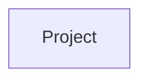

## Component Details

The DigitalOcean Project management subsystem allows users to create, retrieve, update, and delete projects, as well as manage resources associated with those projects. The core component is the `Project` class, which encapsulates the project's data and provides methods for interacting with the DigitalOcean API. The `Project` component relies on the `ResourceManager` to handle the actual API calls for project management and resource assignment.

### Project
Represents a DigitalOcean Project. It allows creating, deleting, updating, and managing resources within a project. It also handles loading project details and resources from the DigitalOcean API.
- **Related Classes/Methods**: `digitalocean.Project.Project` (4:144), `digitalocean.Project.Project:__init__` (5:17), `digitalocean.Project.Project:get_object` (20:29), `digitalocean.Project.Project:load` (31:36), `digitalocean.Project.Project:set_as_default_project` (38:49), `digitalocean.Project.Project:create_project` (51:86), `digitalocean.Project.Project:delete_project` (88:90), `digitalocean.Project.Project:update_project` (92:120), `digitalocean.Project.Project:get_all_resources` (122:128), `digitalocean.Project.Project:load_resources` (130:135), `digitalocean.Project.Project:assign_resource` (137:141)