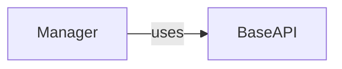

## Component Details

The ResourceManager component, embodied primarily by the `Manager` class, acts as the central interface for interacting with the DigitalOcean API. It handles authentication via an API token, constructs and executes API requests using the `BaseAPI` class, and processes the responses. The `Manager` class provides a suite of methods to retrieve, create, update, and delete various DigitalOcean resources, such as droplets, images, domains, and load balancers. It delegates the actual API interactions to the `BaseAPI` class, which manages the low-level details of HTTP requests and response handling.

### Manager
The Manager class serves as the primary interface for interacting with the DigitalOcean API. It provides methods for retrieving various resources such as droplets, images, domains, and keys. It initializes with an API token and uses the BaseAPI class to handle the underlying API requests.
- **Related Classes/Methods**: `digitalocean.Manager.Manager` (30:481), `digitalocean.Manager.Manager:__init__` (31:32), `digitalocean.Manager.Manager:get_account` (34:38), `digitalocean.Manager.Manager:get_balance` (40:44), `digitalocean.Manager.Manager:get_all_regions` (46:56), `digitalocean.Manager.Manager:get_all_droplets` (58:98), `digitalocean.Manager.Manager:get_droplet` (100:104), `digitalocean.Manager.Manager:get_all_sizes` (106:116), `digitalocean.Manager.Manager:get_images` (118:133), `digitalocean.Manager.Manager:get_all_images` (135:141), `digitalocean.Manager.Manager:get_image` (143:150), `digitalocean.Manager.Manager:get_my_images` (152:158), `digitalocean.Manager.Manager:get_global_images` (160:172), `digitalocean.Manager.Manager:get_distro_images` (174:180), `digitalocean.Manager.Manager:get_app_images` (182:188), `digitalocean.Manager.Manager:get_all_domains` (190:200), `digitalocean.Manager.Manager:get_domain` (202:206), `digitalocean.Manager.Manager:get_all_sshkeys` (208:218), `digitalocean.Manager.Manager:get_ssh_key` (220:224), `digitalocean.Manager.Manager:get_all_tags` (226:233), `digitalocean.Manager.Manager:get_action` (235:239), `digitalocean.Manager.Manager:get_all_floating_ips` (241:251), `digitalocean.Manager.Manager:get_floating_ip` (253:257), `digitalocean.Manager.Manager:get_all_load_balancers` (259:276), `digitalocean.Manager.Manager:get_load_balancer` (278:285), `digitalocean.Manager.Manager:get_certificate` (287:294), `digitalocean.Manager.Manager:get_all_certificates` (296:307), `digitalocean.Manager.Manager:get_snapshot` (309:315), `digitalocean.Manager.Manager:get_all_snapshots` (317:325), `digitalocean.Manager.Manager:get_droplet_snapshots` (327:335), `digitalocean.Manager.Manager:get_volume_snapshots` (337:345), `digitalocean.Manager.Manager:get_all_volumes` (347:371), `digitalocean.Manager.Manager:get_volume` (373:377), `digitalocean.Manager.Manager:get_all_firewalls` (379:397), `digitalocean.Manager.Manager:get_firewall` (399:406), `digitalocean.Manager.Manager:get_vpc` (408:414), `digitalocean.Manager.Manager:get_all_vpcs` (416:427), `digitalocean.Manager.Manager:get_all_projects` (429:439), `digitalocean.Manager.Manager:get_project` (441:448), `digitalocean.Manager.Manager:get_default_project` (450:457), `digitalocean.Manager.Manager:get_all_cdn_endpoints` (459:469), `digitalocean.Manager.Manager:get_cdn_endpoint` (471:478)

### BaseAPI
The BaseAPI class provides the foundation for interacting with the DigitalOcean API. It handles authentication, request construction, and response processing. It is used by the Manager class to perform the actual API calls.
- **Related Classes/Methods**: `digitalocean.baseapi.BaseAPI` (51:276), `digitalocean.baseapi.BaseAPI:__init__` (59:74), `digitalocean.baseapi.BaseAPI:__perform_request` (86:152), `digitalocean.baseapi.BaseAPI:__deal_with_pagination` (154:177), `digitalocean.baseapi.BaseAPI:get_data` (219:267)