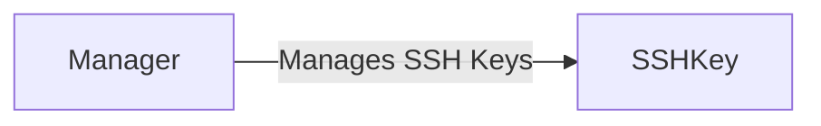

## Component Details

The DigitalOcean SSH Key Management subsystem allows users to manage SSH keys on their DigitalOcean account. It provides functionality to create, retrieve, update, and delete SSH keys. The core components involved are the SSHKey resource, which represents an individual SSH key, and the Manager, which provides methods for retrieving SSH keys. These components interact with the DigitalOcean API to perform the requested operations.

### SSHKey
Represents an SSH Key in DigitalOcean. It allows for creation, retrieval, updating, and deletion of SSH keys. It interacts with the DigitalOcean API to perform these operations.
- **Related Classes/Methods**: `digitalocean.SSHKey.SSHKey` (5:98), `digitalocean.SSHKey.SSHKey:__init__` (6:12), `digitalocean.SSHKey.SSHKey:get_object` (15:21), `digitalocean.SSHKey.SSHKey:load` (23:42), `digitalocean.SSHKey.SSHKey:load_by_pub_key` (44:57), `digitalocean.SSHKey.SSHKey:create` (59:71), `digitalocean.SSHKey.SSHKey:edit` (73:89), `digitalocean.SSHKey.SSHKey:destroy` (91:95)

### Manager
The Manager class provides methods for retrieving SSH keys. Specifically, it can retrieve all SSH keys or a single SSH key by its ID. It interacts with the DigitalOcean API to fetch this information.
- **Related Classes/Methods**: `digitalocean.Manager.Manager` (30:481), `digitalocean.Manager.Manager:get_all_sshkeys` (208:218), `digitalocean.Manager.Manager:get_ssh_key` (220:224)