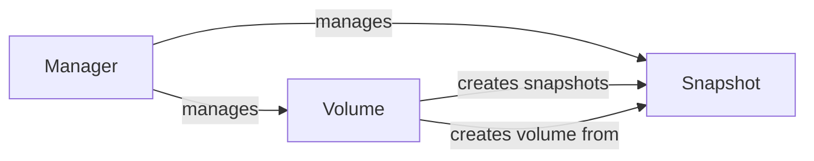

## Component Details

The DigitalOcean storage management subsystem provides functionalities for managing storage resources like Volumes and Snapshots. It allows users to create, destroy, attach, detach, resize volumes, and create snapshots. The Manager component acts as a central point for retrieving and managing these storage resources, interacting with the DigitalOcean API to perform these actions.

### Snapshot
Represents a snapshot object in DigitalOcean. It allows initializing, loading snapshot data, destroying snapshots, and retrieving the object's information. Snapshots can be created from volumes and used to create new volumes.
- **Related Classes/Methods**: `digitalocean.Snapshot.Snapshot:__init__` (6:16), `digitalocean.Snapshot.Snapshot:get_object` (19:25), `digitalocean.Snapshot.Snapshot:load` (27:35), `digitalocean.Snapshot.Snapshot:destroy` (37:41)

### Volume
Represents a volume object in DigitalOcean. It provides functionalities to create, destroy, attach, detach, resize volumes, create snapshots from volumes, and retrieve snapshots associated with a volume. Volumes are the primary storage units and can be attached to droplets.
- **Related Classes/Methods**: `digitalocean.Volume.Volume:__init__` (6:19), `digitalocean.Volume.Volume:get_object` (22:28), `digitalocean.Volume.Volume:load` (30:38), `digitalocean.Volume.Volume:create` (40:75), `digitalocean.Volume.Volume:create_from_snapshot` (77:113), `digitalocean.Volume.Volume:destroy` (115:119), `digitalocean.Volume.Volume:attach` (121:135), `digitalocean.Volume.Volume:detach` (137:151), `digitalocean.Volume.Volume:resize` (153:167), `digitalocean.Volume.Volume:snapshot` (169:180), `digitalocean.Volume.Volume:get_snapshots` (182:195)

### Manager
The Manager class is responsible for managing snapshots and volumes. It provides methods to retrieve individual snapshots and volumes, as well as lists of all snapshots, droplet snapshots, volume snapshots, and all volumes. It acts as a central point for interacting with the DigitalOcean API to manage storage resources.
- **Related Classes/Methods**: `digitalocean.Manager.Manager:get_snapshot` (309:315), `digitalocean.Manager.Manager:get_all_snapshots` (317:325), `digitalocean.Manager.Manager:get_droplet_snapshots` (327:335), `digitalocean.Manager.Manager:get_volume_snapshots` (337:345), `digitalocean.Manager.Manager:get_all_volumes` (347:371), `digitalocean.Manager.Manager:get_volume` (373:377)