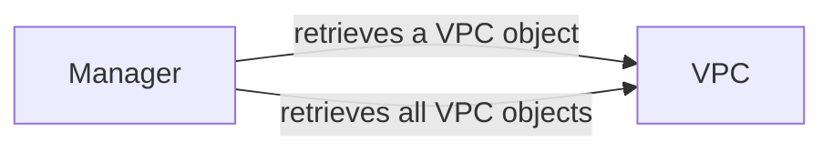

## Component Details

The DigitalOcean VPC management subsystem allows users to create, retrieve, update, and delete Virtual Private Clouds (VPCs). The core components involved are the VPC resource, which represents a VPC and provides methods for interacting with the DigitalOcean API, and the Manager, which provides higher-level functions for listing and retrieving VPCs. The VPC resource encapsulates the attributes and operations associated with a VPC, while the Manager simplifies the process of interacting with multiple VPCs.

### VPC
Represents a DigitalOcean Virtual Private Cloud. It provides methods for creating, retrieving, updating, and deleting VPCs. It encapsulates the attributes and operations associated with a VPC.
- **Related Classes/Methods**: `digitalocean.VPC.VPC` (5:134), `digitalocean.VPC.VPC:__init__` (31:41), `digitalocean.VPC.VPC:get_object` (44:50), `digitalocean.VPC.VPC:load` (52:64), `digitalocean.VPC.VPC:create` (66:89), `digitalocean.VPC.VPC:rename` (91:107), `digitalocean.VPC.VPC:destroy` (127:131)

### Manager
Provides methods for interacting with DigitalOcean resources, including VPCs. It allows listing and retrieving VPC objects.
- **Related Classes/Methods**: `digitalocean.Manager.Manager` (30:481), `digitalocean.Manager.Manager:get_vpc` (408:414), `digitalocean.Manager.Manager:get_all_vpcs` (416:427)