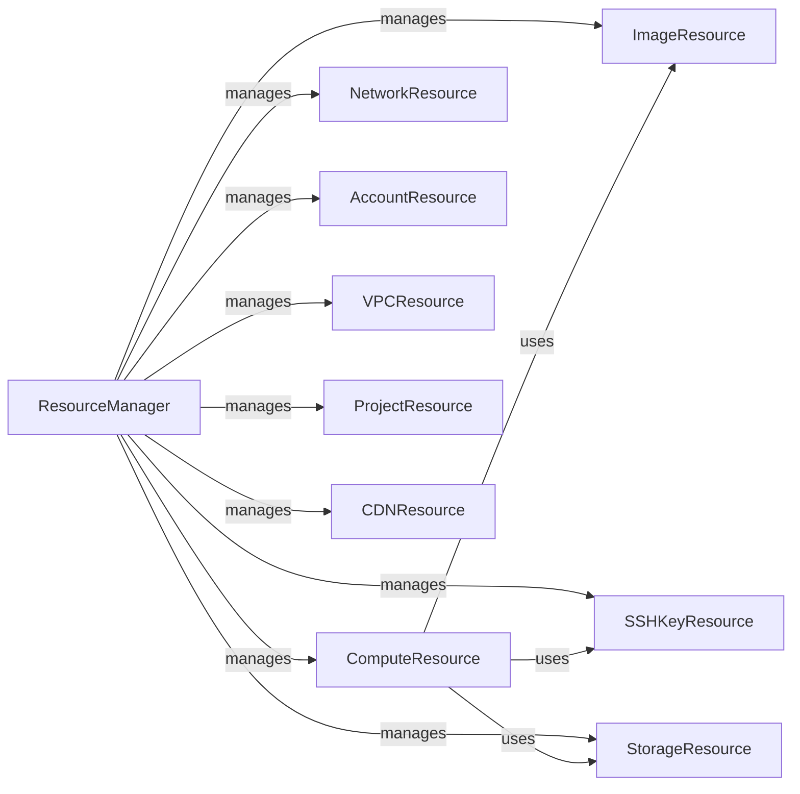

## Component Details

The python-digitalocean library provides a Python interface to the DigitalOcean API. It allows users to manage DigitalOcean resources such as droplets, domains, images, and load balancers programmatically. The library handles authentication, request construction, and response processing, providing a high-level abstraction over the DigitalOcean API. The core functionality revolves around managing various cloud resources through a central manager, which interacts with resource-specific components.

### ResourceManager
The ResourceManager component serves as the central point of interaction with the DigitalOcean API. It handles authentication, request construction, and response processing. It provides methods to retrieve, create, update, and delete various resources such as droplets, images, domains, and load balancers. It orchestrates the retrieval of data and delegates operations to other resource-specific components.
- **Related Classes/Methods**: `digitalocean.Manager.Manager` (30:481), `digitalocean.baseapi.BaseAPI` (51:276)

### ComputeResource
The ComputeResource component represents a DigitalOcean Droplet (virtual server). It provides methods for creating, destroying, and managing Droplets, including actions like power on/off, reboot, resize, snapshot, and backups. It interacts with the ResourceManager to perform these actions.
- **Related Classes/Methods**: `digitalocean.Droplet.Droplet` (25:661)

### NetworkResource
The NetworkResource component represents DigitalOcean networking resources such as Domains, Records, Floating IPs, Load Balancers, and Firewalls. It provides methods for managing these resources, including creating, updating, and deleting them. It interacts with the ResourceManager to perform these actions.
- **Related Classes/Methods**: `digitalocean.Domain.Domain` (6:172), `digitalocean.Record.Record` (5:126), `digitalocean.FloatingIP.FloatingIP` (5:112), `digitalocean.LoadBalancer.LoadBalancer` (85:380), `digitalocean.Firewall.Firewall` (104:303)

### StorageResource
The StorageResource component represents DigitalOcean storage resources such as Volumes and Snapshots. It provides methods for managing these resources, including creating, destroying, attaching, detaching, resizing, and snapshotting. It interacts with the ResourceManager to perform these actions.
- **Related Classes/Methods**: `digitalocean.Volume.Volume` (5:199), `digitalocean.Snapshot.Snapshot` (5:44)

### ImageResource
The ImageResource component represents a DigitalOcean image (snapshot or distribution). It provides methods for managing images, including creating, destroying, transferring, and renaming images. It interacts with the ResourceManager to perform these actions.
- **Related Classes/Methods**: `digitalocean.Image.Image` (5:162)

### AccountResource
The AccountResource component represents a DigitalOcean Account and Balance. It provides methods for retrieving account and balance information. It interacts with the ResourceManager to perform these actions.
- **Related Classes/Methods**: `digitalocean.Account.Account` (5:35), `digitalocean.Balance.Balance` (5:31)

### SSHKeyResource
The SSHKeyResource component represents a DigitalOcean SSH key. It provides methods for managing SSH keys, including creating, retrieving, updating, and deleting SSH keys. It interacts with the ResourceManager to perform these actions.
- **Related Classes/Methods**: `digitalocean.SSHKey.SSHKey` (5:98)

### VPCResource
The VPC Resource component represents a DigitalOcean VPC. It provides methods for managing VPCs, including creating, retrieving, updating, and deleting VPCs. It interacts with the ResourceManager to perform these actions.
- **Related Classes/Methods**: `digitalocean.VPC.VPC` (5:134)

### ProjectResource
The ProjectResource component represents a DigitalOcean Project. It provides methods for managing Projects, including creating, retrieving, updating, deleting, and assigning resources to projects. It interacts with the ResourceManager to perform these actions.
- **Related Classes/Methods**: `digitalocean.Project.Project` (4:144)

### CDNResource
The CDNResource component represents a DigitalOcean CDN Endpoint. It provides methods for managing CDN Endpoints, including creating, retrieving, updating, and deleting CDN Endpoints. It interacts with the ResourceManager to perform these actions.
- **Related Classes/Methods**: `digitalocean.CDNEndpoint.CDNEndpoint` (5:102)